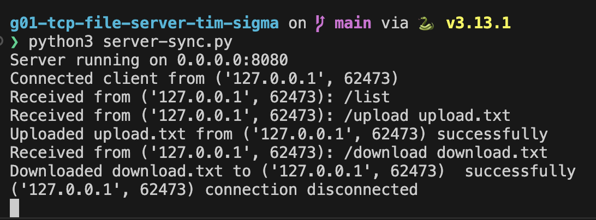
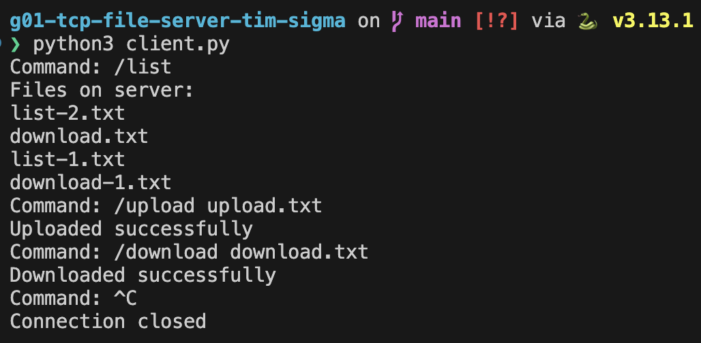
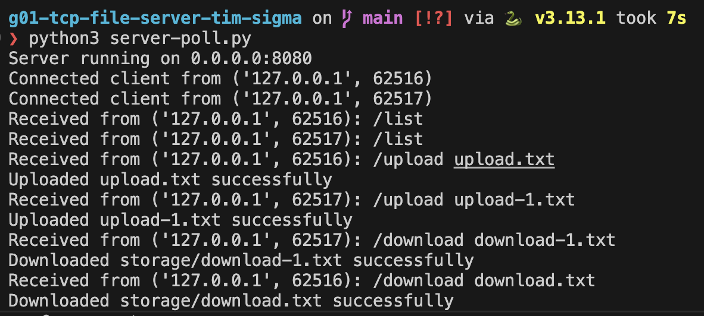
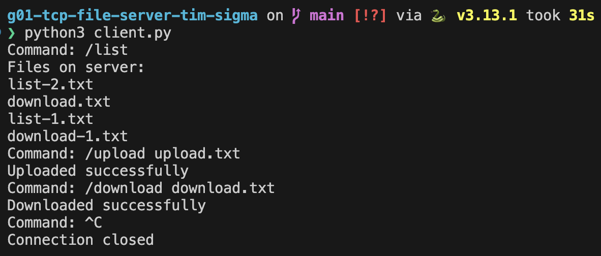
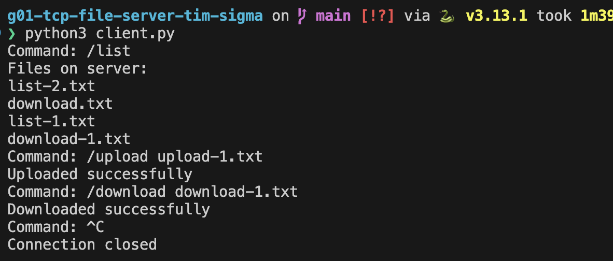

[](https://classroom.github.com/a/mRmkZGKe)

# Network Programming - Assignment G01

## Anggota Kelompok

| Nama                    | NRP        | Kelas |
| ----------------------- | ---------- | ----- |
| Farras Nazhif Pratikno  | 5025241260 | D     |
| Mohammad Najib Bahrudin | 5025241230 | D     |

## Link Youtube (Unlisted)

Link ditaruh di bawah ini

```

```

## Penjelasan Program

### Broadcast Messages

1. `/list`: menampilkan semua file yang ada di folder storage (dari server).
2. `/upload`: meng-upload file yang berada di luar folder storage (namun masih di dalam project) ke folder storage (dari server).
3. `/download`: men-download file yang berada di folder storage (dari server) ke dalam project.

### Client Code

1. Inisialisasi koneksi

```python
client = socket.socket(socket.AF_INET, socket.SOCK_STREAM)
client.connect((HOST, PORT))
```

2. Fungsi `receive_full`

- Menerima data dari socket sampai jumlah byte tertentu (size) terpenuhi

```python
def receive_full(sock, size):
    data = b""
    while len(data) < size:
        chunk = sock.recv(BUFFER_SIZE)
        if not chunk:
            break
        data += chunk
    return data
```

3. List command

- Mengirim command ke server, lalu menerima data dari server

```python
if command.startswith("/list"):
  client.sendall(command.encode())
  data = client.recv(BUFFER_SIZE)
  print("Files on server: ")
  print(data.decode())
```

4. Upload command

```python
elif command.startswith("/upload"):
  # split & check command format
  parts = command.split()
  if len(parts) < 2:
    print("Format usage: /upload <filename>")
    continue

  # parse filename
  filename = parts[1]

  # send command and wait till got ack from server
  client.sendall(command.encode())

  # get file size
  filesize = os.path.getsize(filename)
  # send filesize into server
  client.sendall(str(filesize).encode())

  # receive data from server (response)
  client.recv(BUFFER_SIZE)

  # read file and send it to server
  with open(filename, "rb") as f:
    while True:
        chunk = f.read(BUFFER_SIZE)
        if not chunk:
          break
        client.sendall(chunk)

  # receive & print result message from server
  result = client.recv(BUFFER_SIZE)
  print(result.decode())
```

5. Download command

```python
elif command.startswith("/download"):
  # split & check command format
  parts = command.split()
  if len(parts) < 2:
      print("Format usage: /download <filename>")
      continue

  # parse filename
  filename = parts[1]

  # send command to server
  client.sendall(command.encode())

  # receive server message & check the search result
  server_msg = client.recv(BUFFER_SIZE)
  server_search_msg = str(server_msg.decode())

  if server_search_msg == "File not found":
    print("File not found on server storage")
    continue

  # parse filesize from server
  filesize = int(server_search_msg)

  # send ack
  client.sendall(b"ok\n")

  # receive data from server (response)
  data = receive_full(client, filesize)

  # write the file into client
  with open(filename, "wb") as f:
    f.write(data)

  # receive & print result message from server
  result = client.recv(BUFFER_SIZE)
  print(result.decode())
```

### Synchronous Server Code

1. Inisialisasi koneksi

```python
server = socket.socket(socket.AF_INET, socket.SOCK_STREAM)
# allow port to be reused immediately after restart
server.setsockopt(socket.SOL_SOCKET, socket.SO_REUSEADDR, 1)
server.bind((HOST, PORT))
server.listen(1)
```

2. List command

- Menggunakan `os.listdir` untuk melihat file yang berada di dalam folder tertentu.
- Kirim file-file tersebut ke client dengan ` conn.sendall("\n".join(files).encode())`.

```python
if message.startswith("/list"):
  files = os.listdir(STORAGE_DIR)
  if not files:
    conn.sendall(b"empty")
  else:
    conn.sendall("\n".join(files).encode())
```

3. Upload command

```python
elif message.startswith("/upload"):
  # split & check command format
  parts = message.split()
  if len(parts) < 2:
    conn.sendall(b"error: filename required")
    continue

  # parse filename
  filename = parts[1]

  # ack command from client
  conn.sendall(b"ok\n")

  # receive data size from client & parse it into filesize
  data_size = conn.recv(BUFFER_SIZE)
  filesize = int(data_size.decode())

  # get filepath
  filepath = os.path.join(STORAGE_DIR, filename)

  # write the uploaded file from client
  with open(filepath, "wb") as f:
    received = 0
    while received < filesize:
      chunk = conn.recv(BUFFER_SIZE)
      if not chunk:
        break
      f.write(chunk)
      received += len(chunk)

  # print log for server and send message to client
  print(f"Uploaded {filename} from {addr} successfully")
  conn.sendall(b"Uploaded successfully")
```

4. Download command

```python
elif message.startswith("/download"):
  # split & check command format
  parts = message.split()
  if len(parts) < 2:
    conn.sendall(b"error: filename required")
    continue

  # parse filename & get filepath
  filename = parts[1]
  filepath = os.path.join(STORAGE_DIR, filename)

  # send "not found" message to client if filepath not exists
  if not os.path.exists(filepath):
    conn.sendall(b"File not found")
    continue

  # get filesize & send it to client
  filesize = os.path.getsize(filepath)
  conn.sendall(str(filesize).encode())

  # wait for client ack
  ack = conn.recv(BUFFER_SIZE)

  # read file and send it to client
  with open(filepath, "rb") as f:
    while True:
      chunk = f.read(BUFFER_SIZE)
      if not chunk:
        break
      conn.sendall(chunk)

  # print log for server and send message to client
  print(f"Downloaded {filename} to {addr}  successfully")
  conn.sendall(b"Downloaded successfully")
```

### Server with Select

#### Cara Kerja `select`

`select` digunakan agar server bisa menangani banyak koneksi secara bersamaan tanpa harus menunggu satu client selesai dulu. Server menyimpan semua socket (server dan client) dalam sebuah list, lalu memanggil `select()` untuk menunggu aktivitas. Saat ada socket yang siap, server hanya memproses socket tersebut. Misalnya, `accept()` untuk koneksi baru atau `recv()` untuk menerima data dari client. Dengan cara ini, server menjadi lebih efisien dan tidak perlu membuat thread untuk setiap client.

- `select()` menunggu aktivitas dari banyak socket
- semua socket disimpan dalam list (server + client)
- event utama: socket siap dibaca (readable)
- hasil `select()` berupa list socket yang siap
- server socket → `accept()`, client socket → `recv()`

#### Contoh sesuai state di server

Saat `select()` mendeteksi ada data dari client, server akan memproses sesuai state masing-masing client:

- **state = normal**, server membaca command (seperti `/list`, `/upload`, `/download`)
- **state = upload_size**, server menerima ukuran file, lalu membalas `"ok"`
- **state = upload_data**, server menerima isi file sedikit demi sedikit sampai selesai
- **state = download_wait_ack**, server menunggu `"ok"` dari client, lalu mengirim file

Dengan ini, setiap client diproses sesuai state-nya masing-masing tanpa saling mengganggu, karena setiap socket yang siap diproses secara terpisah berdasarkan event yang diterima.

1. Inisialisasi koneksi

```python
server = socket.socket(socket.AF_INET, socket.SOCK_STREAM)
server.setsockopt(socket.SOL_SOCKET, socket.SO_REUSEADDR, 1)

server.bind((HOST, PORT))
server.listen(5)
```

2. Setup select

```python
inputs = [server]
```

3. Menunggu event dengan select

```python
readable, _, exceptional = select.select(inputs, [], inputs)
```

- `readable`: socket yang siap dibaca
- `exceptional`: socket yang error
- `select()`: akan menunggu sampai ada event/aktivitas

4. Setup new connection / handle existing client

```python
for sock in readable:
    # new connection
    if sock is server:
        conn, addr = server.accept()
        print(f"Connected client from {addr}")

        inputs.append(conn)
        clients[conn] = {"mode": "normal"}
    # existing client
    else:
      ...
```

5. Handle state

```python
# existing client
else:
  try:
      data = sock.recv(BUFFER_SIZE)

      if not data:
        raise ConnectionError()

      state = clients[sock]["mode"]

      if state == "normal":
        handle_message(sock, data)

      elif state == "upload_size":
        try:
          filesize = int(data.decode().strip())
        except ValueError:
          sock.sendall(b"error: invalid file size")
          clients[sock]["mode"] = "normal"
          continue

        clients[sock]["mode"] = "upload_data"
        clients[sock]["filesize"] = filesize
        clients[sock]["received"] = 0

        filepath = os.path.join(STORAGE_DIR, clients[sock]["filename"])
        clients[sock]["file"] = open(filepath, "wb")

        sock.sendall(b"ok\n")

      elif state == "upload_data":
        f = clients[sock]["file"]
        f.write(data)

        clients[sock]["received"] += len(data)

        if clients[sock]["received"] >= clients[sock]["filesize"]:
          f.close()

          print(f"Uploaded {clients[sock]['filename']} successfully")
          sock.sendall(b"Uploaded successfully")

          clients[sock]["mode"] = "normal"

      elif state == "download_wait_ack":
        if data.decode().strip() != "ok":
          continue

        filepath = clients[sock]["filepath"]

        with open(filepath, "rb") as f:
          while True:
            chunk = f.read(BUFFER_SIZE)
            if not chunk:
              break
            sock.sendall(chunk)

        print(f"Downloaded {filepath} successfully")
        sock.sendall(b"Downloaded successfully")

        clients[sock]["mode"] = "normal"

  except Exception as err:
      print(f"Error handling {sock.getpeername()}: {err}")

      if sock in inputs:
        inputs.remove(sock)

      if sock in clients:
        if "file" in clients[sock] and not clients[sock]["file"].closed:
          clients[sock]["file"].close()
        del clients[sock]

      sock.close()
```

6. Handle client message

```python
def handle_message(sock, data):
  try:
    message = data.decode().strip()
  except UnicodeDecodeError:
    return

  if message:
    print(f"Received from {sock.getpeername()}: {message}")

  if message.startswith("/list"):
    files = os.listdir(STORAGE_DIR)
    if not files:
      sock.sendall(b"empty")
    else:
      sock.sendall("\n".join(files).encode())

  elif message.startswith("/upload"):
    parts = message.split()
    if len(parts) < 2:
      sock.sendall(b"error: filename required")
      return

    filename = parts[1]

    clients[sock]["mode"] = "upload_size"
    clients[sock]["filename"] = filename

  elif message.startswith("/download"):
    parts = message.split()
    if len(parts) < 2:
      sock.sendall(b"error: filename required")
      return

    filename = parts[1]
    filepath = os.path.join(STORAGE_DIR, filename)

    if not os.path.exists(filepath):
      sock.sendall(b"File not found")
      return

    filesize = os.path.getsize(filepath)
    sock.sendall(str(filesize).encode())

    clients[sock]["mode"] = "download_wait_ack"
    clients[sock]["filepath"] = filepath

  else:
    addr = sock.getpeername()
    broadcast(f"[{addr[0]}:{addr[1]}] {message}", sock)
```

7. Broadcast message

```python
def broadcast(message, sender_sock):
    for sock in list(clients.keys()):
        if sock != sender_sock and sock.fileno() != -1:
            try:
                sock.sendall(message.encode())
            except Exception:
                pass

    sender_sock.sendall(b"Message broadcasted to other clients")
```

- Mengirim pesan ke semua client kecuali pengirim
- Mengirim ACK ke sender agar tidak blocking

8. Handle exceptional socket

```python
for sock in exceptional:
    if sock in inputs:
        inputs.remove(sock)
    if sock in clients:
        if "file" in clients[sock] and not clients[sock]["file"].closed:
            clients[sock]["file"].close()
        del clients[sock]
    sock.close()
```

- Menangani socket yang error
- Clean up resources

### Server with Poll Code

#### Cara Kerja `poll`

`poll` digunakan agar server bisa menangani banyak koneksi secara bersamaan tanpa harus menunggu satu client selesai dulu. Semua socket didaftarkan ke `poll`, lalu server memanggil `poll()` untuk menunggu aktivitas. Saat ada socket yang siap, server hanya memproses socket tersebut. Sebagai contoh, `accept()` untuk koneksi baru atau `recv()` untuk menerima data dari client. Dengan cara ini, server jadi lebih efisien dan tidak perlu membuat thread untuk setiap client.

- `poll()` menunggu aktivitas dari banyak socket
- socket didaftarkan dengan `poller.register()`
- event utama: `POLLIN` (socket siap dibaca)
- hasil `poll()` berupa `(fd, event)` sehingga perlu mapping ke socket

#### Contoh sesuai state di server

Saat `poll()` mendeteksi ada data dari client, server akan memproses sesuai state masing-masing client:

- **state = normal**, server membaca command (seperti `/list`, `/upload`, `/download`)
- **state = upload_size**, server menerima ukuran file, lalu membalas `"ok"`
- **state = upload_data**, server menerima isi file sedikit demi sedikit sampai selesai
- **state = download_wait_ack**, server menunggu `"ok"` dari client, lalu mengirim file

Dengan ini, setiap client diproses sesuai state-nya masing-masing tanpa saling mengganggu, karena setiap event yang masuk langsung ditangani berdasarkan state client tersebut.

#### Perbedaan `poll` dengan `select`

`select` dan `poll` sama-sama digunakan untuk menangani banyak koneksi secara non-blocking, namun memiliki perbedaan dalam cara kerja dan skalabilitas. `select` menggunakan list socket dan memiliki batas jumlah socket yang bisa dimonitor, sedangkan `poll` menggunakan file descriptor (fd) dengan event yang lebih fleksibel dan tidak memiliki batasan jumlah socket yang sama seperti `select`. Selain itu, `poll` lebih efisien untuk jumlah koneksi yang besar karena tidak perlu memeriksa seluruh list socket setiap kali dipanggil.

- `select` menggunakan list socket, `poll` menggunakan fd + event
- `select` memiliki limit jumlah socket, `poll` lebih scalable
- `select` lebih sederhana, `poll` lebih efisien untuk banyak koneksi
- `select` mengembalikan list socket, `poll` mengembalikan `(fd, event)`
- `poll` lebih cocok untuk sistem dengan jumlah client besar

1. Inisialisasi koneksi

```python
server = socket.socket(socket.AF_INET, socket.SOCK_STREAM)
# allow port to be reused immediately after restart
server.setsockopt(socket.SOL_SOCKET, socket.SO_REUSEADDR, 1)
server.bind((HOST, PORT))
server.listen(5)
```

2. Setup poll

```python
poller = select.poll()
poller.register(server, select.POLLIN)
```

3. Mapping FD ke socket

- Mapping file descriptor dari os ke socket object

```python
fd_to_socket = {server.fileno(): server}
```

4. Setup new connection/handle existing client

```python
# new connection
if sock is server:
  conn, addr = server.accept()
  print(f"Connected client from {addr}")

  # set non-blocking
  conn.setblocking(False)

  # register poll & mapping fd to socket
  poller.register(conn, select.POLLIN)
  fd_to_socket[conn.fileno()] = conn

  # initiate state with normal mode (initial state)
  clients[conn] = {"mode": "normal"}

# existing client
else:
  ...
```

5. Handle state

```python
# existing client
else:
  try:
      # receive incoming data from client socket
      data = sock.recv(BUFFER_SIZE)

      # if no data, client has disconnected
      if not data:
        raise ConnectionError()

      # get current state of this client
      state = clients[sock]["mode"]

      # handle initial command (list, upload, download, etc.)
      if state == "normal":
        handle_message(sock, data)

      elif state == "upload_size":
        # receive file size from client
        filesize = int(data.decode())

        # update state to start receiving file data
        clients[sock]["mode"] = "upload_data"
        clients[sock]["filesize"] = filesize
        clients[sock]["received"] = 0

        # get file path and open file for writing (binary mode)
        filepath = os.path.join(STORAGE_DIR, clients[sock]["filename"])
        clients[sock]["file"] = open(filepath, "wb")

        # send ack to client indicating server is ready to receive file
        sock.sendall(b"ok\n")

      elif state == "upload_data":
        # write incoming chunk to file
        f = clients[sock]["file"]
        f.write(data)

        # track how many bytes have been received
        clients[sock]["received"] += len(data)

        # check if entire file has been received
        if clients[sock]["received"] >= clients[sock]["filesize"]:
          f.close()

          # print log for server and send message to client
          print(f"Uploaded {clients[sock]['filename']} successfully")
          sock.sendall(b"Uploaded successfully")

          # reset state to normal
          clients[sock]["mode"] = "normal"

      elif state == "download_wait_ack":
        # validate ack from client before sending file
        if data.decode().strip() != "ok":
          # ignore invalid ack and wait for correct one by continue looping to outer loop
          continue

        filepath = clients[sock]["filepath"]

        # read file and send it to client
        with open(filepath, "rb") as f:
          while True:
            chunk = f.read(BUFFER_SIZE)
            if not chunk:
              break
            sock.sendall(chunk)

       # print log for server and send message to client
        print(f"Downloaded {filepath} successfully")
        sock.sendall(b"Downloaded successfully")

        # reset state to normal
        clients[sock]["mode"] = "normal"

  except Exception as err:
    # handle error and cleanup client connection
    print(f"Error: {err}")

    poller.unregister(sock)
    sock.close()

    if sock in clients:
      del clients[sock]
    if fd in fd_to_socket:
      del fd_to_socket[fd]
```

6. Handle client message

- Kurang lebih kodenya sama dengan synchronous server. Namun, disesuaikan dengan state handler untuk poll.

```python
def handle_message(sock, data):
  message = data.decode().strip()

  print(f"Received from {sock.getpeername()}: {message}")

  if message.startswith("/list"):
    # get list of files in storage directory
    files = os.listdir(STORAGE_DIR)

    # send file names to client
    if not files:
      sock.sendall(b"empty")
    else:
      sock.sendall("\n".join(files).encode())

  elif message.startswith("/upload"):
    # split & check command format
    parts = message.split()
    if len(parts) < 2:
      sock.sendall(b"error: filename required")
      return

    # parse filename
    filename = parts[1]

    # set client state to expect file size next
    clients[sock]["mode"] = "upload_size"
    clients[sock]["filename"] = filename

  elif message.startswith("/download"):
    # split & check command format
    parts = message.split()
    if len(parts) < 2:
      sock.sendall(b"error: filename required")
      return

    # parse filename & get filepath
    filename = parts[1]
    filepath = os.path.join(STORAGE_DIR, filename)

    # send "not found" message to client if filepath not exists
    if not os.path.exists(filepath):
      sock.sendall(b"File not found")
      return

    # get filesize & send it to client
    filesize = os.path.getsize(filepath)
    sock.sendall(str(filesize).encode())

    # update state to wait for client ack before sending file
    clients[sock]["mode"] = "download_wait_ack"
    clients[sock]["filepath"] = filepath
```

### Server with Thread

#### Cara Kerja `thread`

`thread` adalah metode yang digunakan server agar dapat menangani banyak koneksi secara bersamaan dengan membuat satu thread untuk setiap client. Setiap kali ada client baru yang terhubung, server akan membuat thread baru yang khusus menangani komunikasi dengan client tersebut. Dengan cara ini, setiap client dapat diproses secara paralel tanpa saling menunggu, karena masing-masing berjalan di thread yang berbeda.

- setiap client ditangani oleh thread terpisah
- server utama hanya menerima koneksi (`accept()`)
- komunikasi client dilakukan di dalam fungsi `handle_client`
- tidak perlu event loop seperti `select` atau `poll`
- menggunakan `lock` untuk menghindari race condition pada shared data

#### Contoh alur di server

Saat ada client yang terhubung:

- server menerima koneksi dengan `accept()`
- server membuat thread baru untuk client tersebut
- thread menjalankan `handle_client()`

Di dalam thread, server akan memproses request secara langsung:

- client mengirim command `/list` → server mengirim daftar file
- client mengirim `/upload` → server menerima file sampai selesai
- client mengirim `/download` → server mengirim file ke client
- jika bukan command → pesan akan di-broadcast ke client lain

Dengan ini, setiap client diproses secara paralel di thread masing-masing. Namun, karena ada data bersama (seperti list `clients`), diperlukan `lock` agar tidak terjadi konflik antar thread.

1. Inisialisasi koneksi

```python
server = socket.socket(socket.AF_INET, socket.SOCK_STREAM)
server.setsockopt(socket.SOL_SOCKET, socket.SO_REUSEADDR, 1)

server.bind((HOST, PORT))
server.listen(5)
```

- Membuat socket TCP server
- `SO_REUSEADDR` agar port bisa langsung digunakan kembali
- `listen(5)` untuk menerima beberapa koneksi

2. Setup thread handling

```python
conn, addr = server.accept()

client_thread = threading.Thread(
    target=handle_client,
    args=(conn, addr),
    daemon=True
)
client_thread.start()
```

- Main thread hanya bertugas menerima koneksi
- Setiap client akan ditangani oleh **thread terpisah**
- `daemon=True` agar thread otomatis berhenti saat server mati

3. Shared clients list

```python
clients = []
clients_lock = threading.Lock()
```

- Menyimpan semua koneksi client aktif
- `clients_lock` digunakan untuk **sinkronisasi akses list** (thread-safe)

4. Handle new connection

```python
def handle_client(conn, addr):
    print(f"Connected client from {addr}")

    with clients_lock:
        clients.append(conn)
```

- Setiap client masuk ke dalam list
- Menggunakan lock untuk mencegah race condition

5. Handle existing client

```python
while True:
    data = conn.recv(BUFFER_SIZE)

    if not data:
        break
```

- Menerima data dari client
- Jika kosong → client disconnect

6. Handle command (state implicit)

```python
message = data.decode().strip()
```

- Decode data menjadi string
- Berbeda dengan `poll/select`, di sini **tidak pakai state machine eksplisit**
- Flow dikontrol langsung oleh urutan kode

Command `/list`

```python
files = os.listdir(STORAGE_DIR)
```

- Mengambil daftar file
- Mengirim ke client

Command `/upload`

```python
conn.sendall(b"ok\n")
```

- Kirim ACK ke client

```python
data_size = conn.recv(BUFFER_SIZE)
filesize = int(data_size.decode().strip())
```

- Terima ukuran file

```python
while received < filesize:
    chunk = conn.recv(BUFFER_SIZE)
```

- Terima file per chunk
- Simpan ke storage

```python
conn.sendall(b"Uploaded successfully")
```

Command `/download`

```python
conn.sendall(str(filesize).encode())
```

- Kirim ukuran file ke client

```python
ack = conn.recv(BUFFER_SIZE)
```

- Tunggu ACK dari client

```python
with open(filepath, "rb") as f:
    conn.sendall(chunk)
```

- Kirim file ke client

```python
conn.sendall(b"Downloaded successfully")
```

7. Cleanup connection

```python
finally:
    with clients_lock:
        if conn in clients:
            clients.remove(conn)
    conn.close()
```

- Menghapus client dari list
- Menutup koneksi

### Cara Menjalankan program

- Pilih salah satu server yang ingin dijalankan

```bash
python server-sync.py
python server-select.py
python server-poll.py
python server-thread.py
```

- Jalankan client

```bash
python client.py
```

## Screenshot Hasil

### Synchronous Server

- Server



- Client 1



### Server with Poll

- Server



- Client 1



- Client 2


